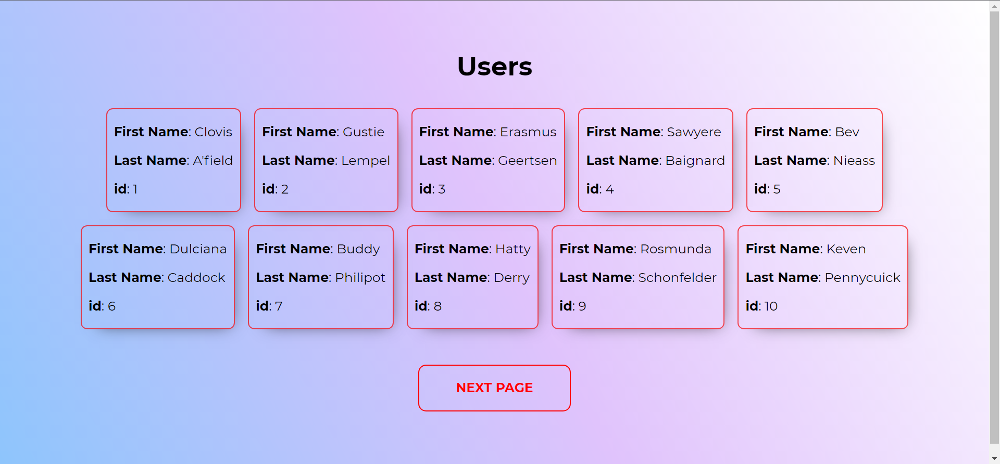

# EXPRESS REACT APP

A simple records system using Express.js, React.js, and Node.js with an API that was implemented on the back-end. 

**This app is still in development. Things I am working on -**
* **Will add mongoDB to make it CRUD**
* **React ui redesign**


Demo: [FrontEnd (hosted on vercel)](https://frontend-rho-steel.vercel.app/)

Api url : [https://backend-api-test-expre.herokuapp.com/api/users](https://backend-api-test-expre.herokuapp.com/api/users) 



## Api Features

https://backend-api-test-expre.herokuapp.com/api/users : It will give details of all users

[https://backend-api-test-expre.herokuapp.com/api/users?page=(page number)](https://backend-api-test-expre.herokuapp.com/api/users?page=1) : It will give 10 users depending upon the page number

> Example https://backend-api-test-expre.herokuapp.com/api/users?page=1

https://backend-api-test-expre.herokuapp.com/api/users/:id : It will give details of a specific user 

> Example https://backend-api-test-expre.herokuapp.com/api/users/11


## Instructions

Fork, then download or clone the repo.


### For the **back-end**

go to *backend* folder via the terminal.

```bash
cd backend
```

install the dependencies once via the terminal.
```bash
npm install
```

Run the *main server*. It listens on port 5000.
```bash
npm statrt
```
View it on the browser.

<br>

### For the **Front-end**

go to *frontend* folder via the terminal.

```bash
cd frontend
```

Install the dependencies required by React once.
```bash
npm install
```

Run the *development server* for React. It listens on port 3000.
```bash
npm start
```

To make a production build, simply run on *react-src* folder via the terminal.
```bash
npm run build
```

It re-creates a folder named *public* on the root directory. This is where the production-ready front-end of the web application resides.


## To Do
- [ ] Create a better UI
- [ ] Add Mongodb
- [ ] Create
- [x] Read
- [ ] Update
- [ ] Delete

